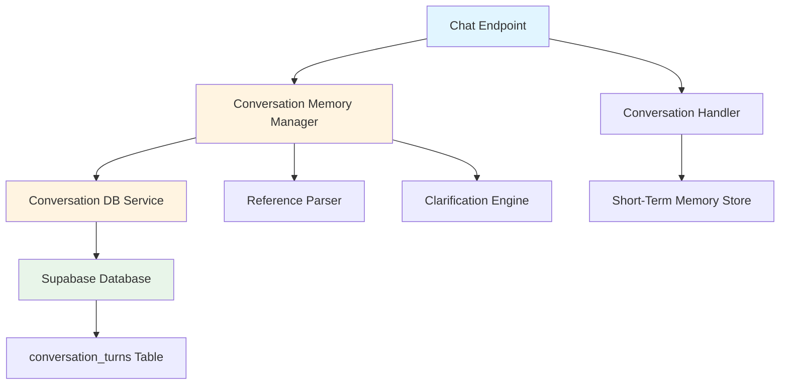
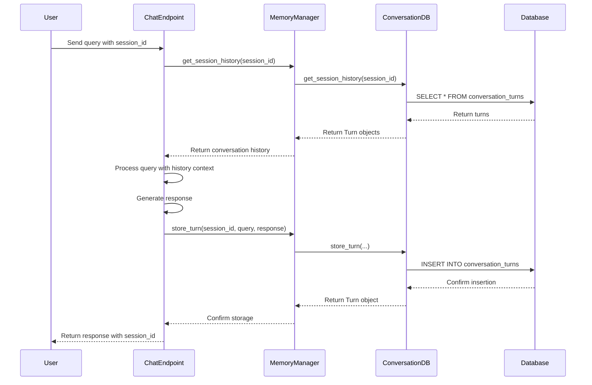

# Design Document: ChatGPT-Style Conversation Memory

## Overview

This design implements ChatGPT-style conversation memory with 24-hour persistence by integrating existing conversation memory infrastructure (`conversation_memory_manager.py`, `conversation_db.py`) into the chat endpoint. The system maintains a hybrid memory architecture where short-term (5-minute) memory handles clarification flows and long-term (24-hour) memory provides persistent conversation history.

The implementation leverages existing database schema (`conversation_turns` table) and cleanup mechanisms (`cleanup_old_conversations()` function) to minimize new code while maximizing functionality. The design prioritizes graceful degradation, ensuring the system continues operating even when database connectivity fails.

## Architecture

### System Components



### Hybrid Memory Architecture

The system maintains two independent memory layers:

1. **Short-Term Memory (5 minutes)**
   - Managed by `ConversationHandler`
   - Stores clarification state in-memory
   - Used for "Which one?" disambiguation flows
   - Expires after 5 minutes of inactivity
   - No database persistence

2. **Long-Term Memory (24 hours)**
   - Managed by `ConversationMemoryManager`
   - Stores conversation turns in Supabase
   - Used for ChatGPT-style conversation continuity
   - Persists across sessions
   - Automatic cleanup after 24 hours

### Integration Flow



## Components and Interfaces

### 1. Chat Endpoint Integration

**File:** `app/api/routes/chat.py`

**Modifications:**

```python
@router.post("/chat", response_model=ChatResponse)
async def chat(request: ChatRequest):
    """
    Enhanced with conversation memory support.
    """
    user_id = getattr(request, 'user_id', None) or "anonymous"
    session_id = getattr(request, 'session_id', None)
    role = getattr(request, 'role', None)
    
    # Generate session_id if not provided
    if not session_id:
        from app.services.conversation_memory_manager import get_memory_manager
        memory_manager = get_memory_manager()
        session_id = memory_manager.create_session(user_id)
    
    # Load conversation history (graceful degradation on failure)
    conversation_history = []
    try:
        from app.services.conversation_memory_manager import get_memory_manager
        memory_manager = get_memory_manager()
        conversation_history = memory_manager.get_session_history(session_id, limit=20)
    except Exception as e:
        logger.warning(f"Failed to load conversation history: {e}")
        # Continue without history (graceful degradation)
    
    # Check for clarification state (SHORT-TERM memory - unchanged)
    try:
        clarification_state = ConversationHandler.get_clarification(user_id)
        if clarification_state:
            return await handle_clarification_response(request, user_id, clarification_state)
    except Exception as e:
        logger.error(f"Error retrieving clarification state: {e}")
    
    # Process query (existing logic)
    response = await handle_new_query(request, user_id, role)
    
    # Store conversation turn (LONG-TERM memory - new)
    try:
        from app.services.conversation_memory_manager import get_memory_manager
        memory_manager = get_memory_manager()
        memory_manager.store_turn(
            session_id=session_id,
            user_id=user_id,
            query=request.query,
            response=response.message,
            metadata={
                "intent": response.intent,
                "confidence": response.confidence,
                "result_count": len(response.data) if response.data else 0
            }
        )
    except Exception as e:
        logger.error(f"Failed to store conversation turn: {e}")
        # Continue anyway (graceful degradation)
    
    # Include session_id in response
    response.session_id = session_id
    
    return response
```

**Key Design Decisions:**

- Session ID generation happens at the endpoint level for simplicity
- Conversation history loading occurs before query processing
- Turn storage happens after response generation (fire-and-forget pattern)
- All memory operations use try-except for graceful degradation
- Short-term clarification memory remains completely unchanged

### 2. Request/Response Models

**File:** `app/models/requests.py`

**Addition:**

```python
class ChatRequest(BaseModel):
    query: str
    user_id: Optional[str] = None
    role: Optional[str] = None
    session_id: Optional[str] = None  # NEW: Optional session identifier
```

**File:** `app/models/responses.py`

**Addition:**

```python
class ChatResponse(BaseModel):
    query: str
    message: str
    data: List[Dict[str, Any]]
    intent: str
    confidence: float
    session_id: Optional[str] = None  # NEW: Session identifier for client tracking
    metadata: Optional[Dict[str, Any]] = None
    error: Optional[str] = None
```

### 3. Conversation Memory Manager

**File:** `app/services/conversation_memory_manager.py` (EXISTING - NO CHANGES)

This service is already complete and provides:

- `store_turn()`: Store conversation turn in database
- `get_session_history()`: Retrieve conversation history
- `create_session()`: Generate new session ID
- `delete_session()`: Delete session and all turns
- `get_context_for_query()`: Assemble context with reference resolution

**Interface:**

```python
class ConversationMemoryManager:
    def store_turn(
        self,
        session_id: str,
        user_id: str,
        query: str,
        response: str,
        metadata: Optional[Dict[str, Any]] = None
    ) -> Turn
    
    def get_session_history(
        self,
        session_id: str,
        limit: int = 50
    ) -> List[Turn]
    
    def create_session(self, user_id: str) -> str
    
    def delete_session(self, session_id: str) -> int
```

### 4. Conversation Database Service

**File:** `app/services/conversation_db.py` (EXISTING - NO CHANGES)

This service is already complete and provides:

- `store_turn()`: Insert turn into database
- `get_session_history()`: Query turns by session_id
- `create_session()`: Generate UUID for new session
- `delete_session()`: Delete all turns for a session
- `cleanup_old_conversations()`: Remove turns older than 24 hours

**Interface:**

```python
class ConversationDatabaseService:
    def store_turn(
        self,
        session_id: str,
        user_id: str,
        query: str,
        response: str,
        metadata: Optional[Dict[str, Any]] = None
    ) -> Turn
    
    def get_session_history(
        self,
        session_id: str,
        limit: int = 50
    ) -> List[Turn]
    
    def cleanup_old_conversations(self) -> CleanupResult
```

### 5. Cleanup Service

**File:** `app/services/cleanup_service.py` (EXISTING - NO CHANGES)

This service already exists and provides scheduled cleanup:

- Runs cleanup every 6 hours
- Calls `cleanup_old_conversations()` database function
- Logs cleanup statistics
- Handles errors gracefully

**No modifications needed** - the existing cleanup service will automatically handle 24-hour TTL for conversation turns.

## Data Models

### Turn Model

**File:** `app/models/conversation.py` (EXISTING)

```python
@dataclass
class Turn:
    """Represents a single conversation turn."""
    id: str
    session_id: str
    user_id: str
    turn_number: int
    query_text: str
    response_text: str
    created_at: datetime
    metadata: Dict[str, Any]
    
    @classmethod
    def from_dict(cls, data: Dict[str, Any]) -> 'Turn':
        """Create Turn from database row."""
        return cls(
            id=data['id'],
            session_id=data['session_id'],
            user_id=data['user_id'],
            turn_number=data['turn_number'],
            query_text=data['query_text'],
            response_text=data['response_text'],
            created_at=data['created_at'],
            metadata=data.get('metadata', {})
        )
```

### Database Schema

**Table:** `conversation_turns` (EXISTING)

```sql
CREATE TABLE conversation_turns (
    id UUID PRIMARY KEY DEFAULT gen_random_uuid(),
    session_id UUID NOT NULL,
    user_id UUID NOT NULL,
    turn_number INTEGER NOT NULL,
    query_text TEXT NOT NULL,
    response_text TEXT NOT NULL,
    created_at TIMESTAMP WITH TIME ZONE DEFAULT NOW(),
    metadata JSONB DEFAULT '{}'::jsonb,
    
    CONSTRAINT unique_session_turn UNIQUE (session_id, turn_number),
    CONSTRAINT positive_turn_number CHECK (turn_number > 0),
    CONSTRAINT non_empty_query CHECK (LENGTH(TRIM(query_text)) > 0),
    CONSTRAINT non_empty_response CHECK (LENGTH(TRIM(response_text)) > 0)
);
```

**Indexes:**

- `idx_session_id`: Fast lookup by session
- `idx_created_at`: Efficient cleanup queries
- `idx_user_sessions`: User session queries

### CleanupResult Model

**File:** `app/models/conversation.py` (EXISTING)

```python
@dataclass
class CleanupResult:
    """Result of cleanup operation."""
    sessions_deleted: int
    turns_deleted: int
    execution_time: float
    errors: List[str]
```

## Correctness Properties

*A property is a characteristic or behavior that should hold true across all valid executions of a system—essentially, a formal statement about what the system should do. Properties serve as the bridge between human-readable specifications and machine-verifiable correctness guarantees.*


### Property 1: Turn Storage Completeness

*For any* valid conversation turn (session_id, user_id, query, response), when stored through the Conversation_Memory_Manager, the turn should be retrievable from the database with all required fields (session_id, user_id, query_text, response_text, turn_number, created_at, metadata) present and non-empty.

**Validates: Requirements 1.1, 1.2, 7.3**

### Property 2: Session ID Uniqueness and Format

*For any* sequence of session creation requests, each generated session_id should be unique, properly formatted as a UUID, and included in all API responses.

**Validates: Requirements 2.1, 2.5, 7.1**

### Property 3: Session Isolation

*For any* two different sessions with stored turns, retrieving conversation history for one session should return only turns belonging to that session and not include turns from the other session.

**Validates: Requirements 2.3, 5.1**

### Property 4: Session Continuity

*For any* existing session with stored turns, when a request is made with that session_id, the system should use the provided session_id and retrieve the correct conversation history.

**Validates: Requirements 2.2**

### Property 5: Invalid Session Handling

*For any* invalid or non-existent session_id, the system should handle it gracefully by treating it as a new conversation session without throwing errors.

**Validates: Requirements 2.4, 5.4**

### Property 6: TTL Enforcement

*For any* set of conversation turns with varying created_at timestamps, when the cleanup service runs, all turns older than 24 hours should be deleted while turns within the 24-hour window should remain.

**Validates: Requirements 3.1, 5.5**

### Property 7: Chronological Ordering

*For any* session with multiple turns stored in random order, when retrieving conversation history, the turns should be returned ordered chronologically by turn_number (or created_at timestamp).

**Validates: Requirements 5.2**

### Property 8: Graceful Degradation on Database Failure

*For any* database connection failure or timeout, the system should continue operating by falling back to in-memory storage, still providing conversation responses without throwing errors to the user.

**Validates: Requirements 1.5, 6.1, 6.4, 6.5, 7.5**

### Property 9: Memory Layer Independence

*For any* conversation session using both short-term clarification memory and long-term conversation memory, operations on one memory layer should not affect the state or behavior of the other memory layer.

**Validates: Requirements 4.3, 4.4, 4.5**

### Property 10: Long-Term Memory Persistence

*For any* conversation turn stored in long-term memory, the turn should remain retrievable for the full 24-hour TTL period regardless of system restarts or session interruptions.

**Validates: Requirements 4.2**

### Property 11: Database Constraint Compliance

*For any* attempt to store invalid conversation data (empty query, empty response, negative turn_number, duplicate session_id + turn_number), the database should enforce constraints and reject the invalid data.

**Validates: Requirements 9.3**

### Property 12: Error Logging with Context

*For any* database operation failure, the system should log an error message that includes contextual information (session_id, user_id, operation type, error details).

**Validates: Requirements 10.1, 10.5**

## Error Handling

### Database Connection Failures

**Strategy:** Graceful degradation with in-memory fallback

```python
def store_turn_with_fallback(session_id, user_id, query, response):
    """Store turn with graceful degradation."""
    try:
        # Attempt database storage
        return conversation_db.store_turn(session_id, user_id, query, response)
    except (ConnectionError, TimeoutError, SupabaseError) as e:
        logger.warning(f"Database unavailable, using in-memory fallback: {e}")
        # Fall back to in-memory storage
        return in_memory_store.store_turn(session_id, user_id, query, response)
```

**Behavior:**
- Database failures do not block user responses
- System logs warnings when operating in degraded mode
- In-memory storage provides temporary continuity
- Normal operation resumes when database recovers

### Invalid Input Handling

**Strategy:** Validation with informative error messages

```python
def validate_turn_input(session_id, user_id, query, response):
    """Validate turn input before storage."""
    if not session_id or not is_valid_uuid(session_id):
        raise ValueError("Invalid session_id: must be a valid UUID")
    
    if not user_id or not is_valid_uuid(user_id):
        raise ValueError("Invalid user_id: must be a valid UUID")
    
    if not query or not query.strip():
        raise ValueError("Query cannot be empty")
    
    if not response or not response.strip():
        raise ValueError("Response cannot be empty")
```

**Behavior:**
- Input validation occurs before database operations
- Clear error messages indicate what went wrong
- Invalid requests are rejected early
- Database constraints provide additional safety

### Cleanup Failures

**Strategy:** Retry on next scheduled run with error logging

```python
def scheduled_cleanup():
    """Run cleanup with error handling."""
    try:
        result = conversation_db.cleanup_old_conversations()
        logger.info(f"Cleanup completed: {result.sessions_deleted} sessions, "
                   f"{result.turns_deleted} turns deleted")
    except Exception as e:
        logger.error(f"Cleanup failed: {e}")
        # Will retry on next scheduled run (6 hours)
```

**Behavior:**
- Cleanup failures are logged but don't crash the service
- Next scheduled run will retry the cleanup
- Temporary cleanup failures don't affect user-facing functionality
- Manual cleanup can be triggered if needed

### Session ID Conflicts

**Strategy:** UUID generation ensures uniqueness

```python
def create_session(user_id):
    """Create new session with guaranteed unique ID."""
    session_id = str(uuid4())  # UUID v4 provides statistical uniqueness
    logger.info(f"Created session {session_id[:8]}... for user {user_id[:8]}...")
    return session_id
```

**Behavior:**
- UUID v4 provides 128-bit uniqueness (collision probability: ~10^-38)
- No database lookup needed for uniqueness verification
- Session creation is fast and non-blocking
- Conflicts are statistically impossible

## Testing Strategy

### Dual Testing Approach

This feature requires both unit tests and property-based tests for comprehensive coverage:

**Unit Tests:**
- Specific examples of turn storage and retrieval
- Edge cases (empty sessions, invalid UUIDs, database failures)
- Integration points with chat endpoint
- Backward compatibility with Phase 3 clarification flows
- Error conditions and graceful degradation scenarios

**Property-Based Tests:**
- Universal properties across all valid inputs
- Randomized session IDs, user IDs, queries, and responses
- Comprehensive input coverage through randomization
- Minimum 100 iterations per property test

### Property-Based Testing Configuration

**Library:** Use `hypothesis` for Python property-based testing

**Configuration:**
```python
from hypothesis import given, settings, strategies as st

@settings(max_examples=100)
@given(
    session_id=st.uuids(),
    user_id=st.uuids(),
    query=st.text(min_size=1, max_size=1000),
    response=st.text(min_size=1, max_size=5000)
)
def test_property_turn_storage_completeness(session_id, user_id, query, response):
    """
    Feature: chatgpt-style-conversation-memory
    Property 1: Turn Storage Completeness
    """
    # Test implementation
    pass
```

**Test Organization:**
- Each correctness property maps to one property-based test
- Each test includes a comment referencing the design property
- Tag format: `Feature: chatgpt-style-conversation-memory, Property N: {property_text}`
- Minimum 100 iterations per test (configured via `@settings(max_examples=100)`)

### Unit Test Focus Areas

1. **Chat Endpoint Integration**
   - Session ID extraction and generation
   - Conversation history loading
   - Turn storage after response
   - Response format with session_id

2. **Graceful Degradation**
   - Database connection failures
   - Timeout handling
   - In-memory fallback behavior
   - Recovery when database returns

3. **Backward Compatibility**
   - Phase 3 clarification flows still work
   - Existing API contracts maintained
   - No breaking changes to service interfaces

4. **Edge Cases**
   - Empty conversation history
   - Invalid session IDs
   - Malformed UUIDs
   - Very long queries/responses
   - Concurrent turn storage

### Integration Testing

**Scenarios:**
1. End-to-end conversation flow with multiple turns
2. Session continuity across multiple requests
3. Cleanup service execution and verification
4. Database failure and recovery
5. Mixed short-term and long-term memory usage

**Test Data:**
- Use existing test data from Phase 3 tests
- Generate synthetic conversation sessions
- Create backdated turns for TTL testing
- Simulate various database failure modes

### Backward Compatibility Testing

**Critical Requirement:** All existing Phase 3 tests must pass

**Verification:**
```bash
# Run existing Phase 3 test suite
pytest test_phase3_*.py -v

# Expected: All tests pass without modifications
```

**Test Files:**
- `test_phase3_nlp_comprehensive.py`
- `test_phase3_nlp_improved.py`
- `test_phase3_fixed_with_real_data.py`
- `test_phase3_production_real_data.py`
- `test_conversational_scenarios_final.py`

**Success Criteria:**
- Zero test failures in existing Phase 3 suite
- No modifications needed to existing tests
- Clarification flows work identically
- Short-term memory behavior unchanged

### Performance Considerations

**Database Query Optimization:**
- Leverage existing indexes on `session_id` and `created_at`
- Limit conversation history retrieval (default: 20 turns, max: 50)
- Use prepared statements for turn insertion
- Batch cleanup operations

**Memory Management:**
- In-memory fallback limited to current session only
- No unbounded memory growth
- Cleanup service prevents database bloat
- Turn metadata kept minimal

**Response Time Targets:**
- Turn storage: < 100ms (async, non-blocking)
- History retrieval: < 200ms (before query processing)
- Cleanup operation: < 5 seconds (background task)
- Graceful degradation: < 50ms overhead

## Implementation Notes

### Minimal Code Changes

This design leverages existing infrastructure to minimize new code:

**Existing Components (No Changes):**
- `conversation_memory_manager.py` - Complete, ready to use
- `conversation_db.py` - Complete, ready to use
- `conversation_turns` table - Already created
- `cleanup_old_conversations()` function - Already exists
- `cleanup_service.py` - Already scheduled

**New Code Required:**
- Chat endpoint integration (~50 lines)
- Request/Response model updates (~10 lines)
- Unit tests (~300 lines)
- Property-based tests (~200 lines)

**Total New Code:** ~560 lines

### Configuration

**Environment Variables:**

```bash
# Existing Supabase configuration (no changes needed)
SUPABASE_URL=https://your-project.supabase.co
SUPABASE_KEY=your-service-role-key

# Conversation memory settings (optional)
CONVERSATION_HISTORY_LIMIT=20  # Default: 20 turns
CONVERSATION_TTL_HOURS=24      # Default: 24 hours
CLEANUP_INTERVAL_HOURS=6       # Default: 6 hours
```

### Deployment Considerations

**Database Migration:**
- No migration needed (schema already exists)
- Verify `conversation_turns` table exists
- Verify indexes are created
- Verify cleanup function exists

**Rollback Plan:**
- Remove session_id from request/response models
- Remove conversation memory calls from chat endpoint
- System reverts to stateless behavior
- No data loss (turns remain in database)

**Monitoring:**
- Track turn storage success/failure rates
- Monitor cleanup execution and deletion counts
- Alert on sustained database connection failures
- Track in-memory fallback activation frequency

### Security Considerations

**Row-Level Security (RLS):**
- Already configured on `conversation_turns` table
- Users can only access their own conversations
- Service role has full access for cleanup
- No additional RLS policies needed

**Data Privacy:**
- Automatic 24-hour deletion ensures data minimization
- User conversations isolated by user_id
- No cross-user data leakage
- Metadata field allows future privacy enhancements

**Input Validation:**
- UUID format validation for session_id and user_id
- Text length limits on query and response
- Database constraints enforce data integrity
- SQL injection prevented by parameterized queries
