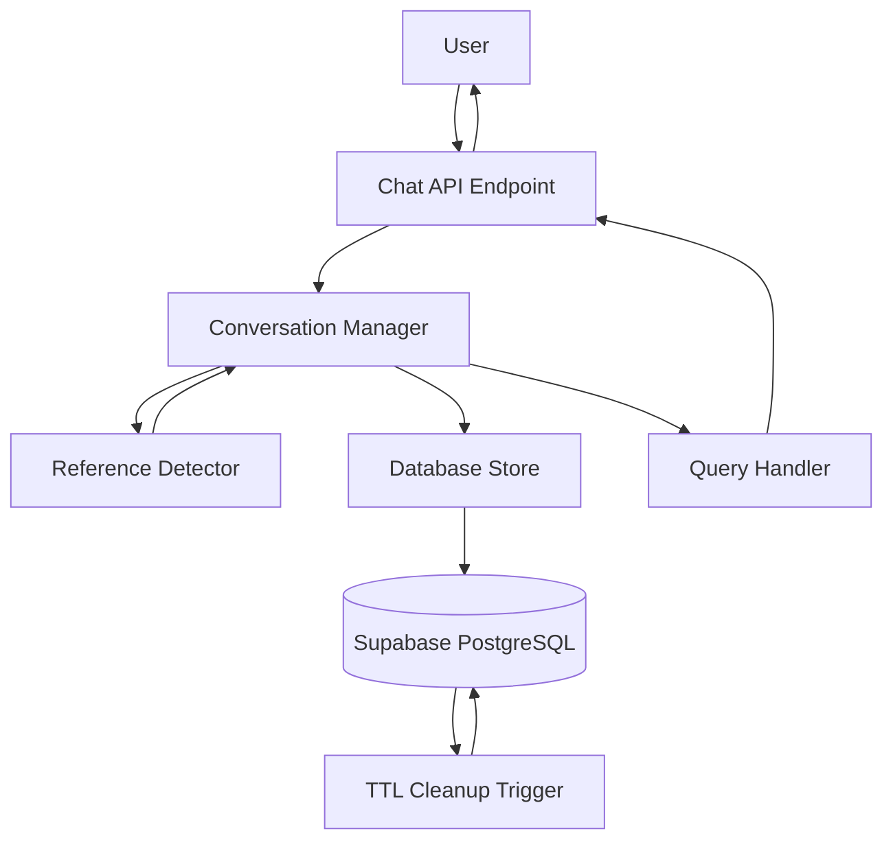

# Design Document: Database-Based Long-Term Conversation Memory

## Overview

This design implements a production-ready conversation memory system using Supabase PostgreSQL for zero-cost persistent storage. The system supports 10+ turn conversations with automatic 24-hour TTL, dynamic turn reference detection, and survives server restarts. The architecture prioritizes performance, scalability, and maintainability while staying within free tier limits.

## Architecture

### High-Level Architecture



### Component Responsibilities

1. **Conversation Manager**: Orchestrates conversation storage, retrieval, and context building
2. **Reference Detector**: Dynamically identifies and resolves turn references using regex patterns
3. **Database Store**: Handles all database operations with connection pooling and error handling
4. **TTL Cleanup**: Automated database trigger that removes conversations older than 24 hours

### Data Flow

1. User sends message → Chat API receives request
2. Conversation Manager retrieves last 10 turns from Database Store
3. Reference Detector analyzes message for turn references
4. If reference found → Resolve to specific turn and extract context
5. Query Handler processes message with conversation context
6. Response generated → Conversation Manager stores new turn asynchronously
7. TTL Cleanup runs periodically to remove old conversations

## Components and Interfaces

### 1. Database Schema

```sql
-- Conversation history table
CREATE TABLE conversation_history (
    id UUID PRIMARY KEY DEFAULT gen_random_uuid(),
    user_id TEXT NOT NULL,
    turn_index INTEGER NOT NULL,
    user_message TEXT NOT NULL,
    ai_response TEXT NOT NULL,
    metadata JSONB DEFAULT '{}',
    created_at TIMESTAMPTZ NOT NULL DEFAULT NOW(),
    
    -- Composite index for efficient queries
    CONSTRAINT unique_user_turn UNIQUE (user_id, turn_index)
);

-- Indexes for performance
CREATE INDEX idx_conversation_user_time ON conversation_history(user_id, created_at DESC);
CREATE INDEX idx_conversation_ttl ON conversation_history(created_at) WHERE created_at < NOW() - INTERVAL '24 hours';

-- Automatic TTL cleanup trigger
CREATE OR REPLACE FUNCTION cleanup_old_conversations()
RETURNS TRIGGER AS $$
BEGIN
    DELETE FROM conversation_history
    WHERE created_at < NOW() - INTERVAL '24 hours';
    RETURN NULL;
END;
$$ LANGUAGE plpgsql;

CREATE TRIGGER trigger_cleanup_conversations
    AFTER INSERT ON conversation_history
    EXECUTE FUNCTION cleanup_old_conversations();
```

### 2. Conversation Manager

**Interface:**
```python
class ConversationManager:
    """Manages conversation history storage and retrieval."""
    
    async def store_turn(
        self,
        user_id: str,
        user_message: str,
        ai_response: str,
        metadata: dict = None
    ) -> bool:
        """Store a conversation turn asynchronously."""
        pass
    
    async def get_history(
        self,
        user_id: str,
        limit: int = 10
    ) -> List[ConversationTurn]:
        """Retrieve recent conversation history."""
        pass
    
    async def get_turn_by_reference(
        self,
        user_id: str,
        reference: str
    ) -> Optional[ConversationTurn]:
        """Resolve turn reference and retrieve specific turn."""
        pass
    
    async def clear_history(self, user_id: str) -> bool:
        """Clear all conversation history for a user."""
        pass
```

**Data Model:**
```python
@dataclass
class ConversationTurn:
    """Represents a single conversation turn."""
    turn_index: int
    user_message: str
    ai_response: str
    timestamp: datetime
    metadata: dict
```

### 3. Reference Detector

**Interface:**
```python
class ReferenceDetector:
    """Dynamically detects and resolves turn references."""
    
    def detect_reference(self, message: str) -> Optional[TurnReference]:
        """Detect if message contains a turn reference."""
        pass
    
    def resolve_reference(
        self,
        reference: TurnReference,
        history: List[ConversationTurn]
    ) -> Optional[ConversationTurn]:
        """Resolve reference to specific turn."""
        pass
```

**Reference Patterns (Dynamic Regex):**
```python
REFERENCE_PATTERNS = {
    # Ordinal references (English)
    'ordinal_en': r'\b(first|second|third|fourth|fifth|1st|2nd|3rd|4th|5th)\b',
    
    # Ordinal references (Filipino)
    'ordinal_fil': r'\b(una|dalawa|tatlo|apat|lima|pangalawa|pangatlo)\b',
    
    # Temporal references (English)
    'temporal_en': r'\b(previous|last|earlier|before|recent)\b',
    
    # Temporal references (Filipino)
    'temporal_fil': r'\b(kanina|nakaraan|dati|yung\s+una|yung\s+last)\b',
    
    # Demonstrative references
    'demonstrative': r'\b(that|yun|yan|yung)\b',
    
    # Numeric references
    'numeric': r'\b(\d+)(st|nd|rd|th)?\b'
}
```

**Resolution Logic:**
```python
def resolve_reference(self, reference: TurnReference, history: List[ConversationTurn]) -> Optional[ConversationTurn]:
    """
    Resolve reference to specific turn using pattern matching.
    
    Examples:
    - "yung una" / "first" → history[0] (oldest turn)
    - "kanina" / "last" → history[-1] (most recent turn)
    - "second" / "pangalawa" → history[1]
    - "3rd" / "tatlo" → history[2]
    """
    if reference.type == 'ordinal':
        index = reference.position - 1  # Convert to 0-based index
        return history[index] if 0 <= index < len(history) else None
    
    elif reference.type == 'temporal':
        if reference.direction == 'first':
            return history[0] if history else None
        elif reference.direction == 'last':
            return history[-1] if history else None
    
    elif reference.type == 'numeric':
        index = reference.number - 1
        return history[index] if 0 <= index < len(history) else None
    
    return None
```

### 4. Database Store

**Interface:**
```python
class DatabaseStore:
    """Handles all database operations for conversation storage."""
    
    def __init__(self, supabase_client):
        self.client = supabase_client
        self.max_retries = 3
        self.retry_delay = 0.1  # 100ms
    
    async def insert_turn(
        self,
        user_id: str,
        turn_index: int,
        user_message: str,
        ai_response: str,
        metadata: dict
    ) -> bool:
        """Insert a new conversation turn with retry logic."""
        pass
    
    async def fetch_recent_turns(
        self,
        user_id: str,
        limit: int = 10
    ) -> List[dict]:
        """Fetch recent turns within 24-hour window."""
        pass
    
    async def get_turn_count(self, user_id: str) -> int:
        """Get count of active turns for user."""
        pass
    
    async def delete_oldest_turn(self, user_id: str) -> bool:
        """Delete oldest turn when limit exceeded."""
        pass
```

**Query Optimization:**
```sql
-- Efficient query for recent turns (uses index)
SELECT *
FROM conversation_history
WHERE user_id = $1
  AND created_at > NOW() - INTERVAL '24 hours'
ORDER BY created_at DESC
LIMIT 10;

-- Get turn count (uses index)
SELECT COUNT(*)
FROM conversation_history
WHERE user_id = $1
  AND created_at > NOW() - INTERVAL '24 hours';

-- Delete oldest turn (uses index)
DELETE FROM conversation_history
WHERE id = (
    SELECT id
    FROM conversation_history
    WHERE user_id = $1
    ORDER BY created_at ASC
    LIMIT 1
);
```

## Data Models

### ConversationTurn

```python
@dataclass
class ConversationTurn:
    """Represents a single conversation turn."""
    turn_index: int          # Sequential index (1-10)
    user_message: str        # Original user message
    ai_response: str         # AI's response
    timestamp: datetime      # When turn was created
    metadata: dict          # Additional context (query type, entities, etc.)
    
    def to_context_string(self) -> str:
        """Format turn for AI context."""
        return f"[Turn {self.turn_index}] User: {self.user_message}\nAI: {self.ai_response}"
```

### TurnReference

```python
@dataclass
class TurnReference:
    """Represents a detected turn reference."""
    type: str               # 'ordinal', 'temporal', 'numeric', 'demonstrative'
    position: Optional[int] # For ordinal/numeric (1-based)
    direction: Optional[str] # For temporal ('first', 'last')
    raw_text: str           # Original reference text
    confidence: float       # Detection confidence (0.0-1.0)
```

### ConversationContext

```python
@dataclass
class ConversationContext:
    """Complete conversation context for query processing."""
    user_id: str
    current_message: str
    history: List[ConversationTurn]
    referenced_turn: Optional[ConversationTurn]
    
    def get_context_window(self, window_size: int = 3) -> List[ConversationTurn]:
        """Get last N turns for context."""
        return self.history[-window_size:] if self.history else []
    
    def format_for_ai(self) -> str:
        """Format context for AI prompt."""
        if not self.history:
            return self.current_message
        
        context_parts = [turn.to_context_string() for turn in self.history]
        context_parts.append(f"[Current] User: {self.current_message}")
        return "\n\n".join(context_parts)
```

## Correctness Properties

*A property is a characteristic or behavior that should hold true across all valid executions of a system—essentially, a formal statement about what the system should do. Properties serve as the bridge between human-readable specifications and machine-verifiable correctness guarantees.*

