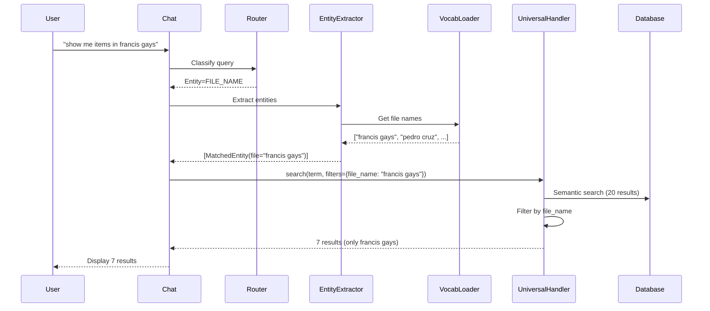

# Dynamic Entity Filtering - Design Document

**Feature Name:** dynamic-entity-filtering  
**Status:** Draft  
**Created:** February 15, 2026  
**Last Updated:** February 15, 2026

---

## Architecture Overview

The dynamic entity filtering system adds intelligent entity detection and exact filtering on top of the existing semantic search. It works in three stages:

1. **Entity Detection** - Extract entities (file names, project names, categories) from user query
2. **Filter Building** - Build exact match filters based on detected entities
3. **Filter Application** - Apply filters to search results for precise matching

```
Use High-Level Flow

```
User Query
    ↓
[Router Service] → Detects intent, entity type hint
    ↓
[Entity Extractor] → Extracts entities using Vocabulary_Loader
    ↓
[Chat Endpoint] → Converts entities to filters
    ↓
[UniversalHandler] → Semantic search + exact filtering
    ↓
Filtered Results
```

### Component Interaction



## Components and Interfaces

### 1. Entity Extractor Service

**Purpose**: Extract entities from queries using database vocabulary and fuzzy matching.

**Location**: `app/services/entity_extractor.py` (new file)

**Interface**:

```python
@dataclass
class ExtractedEntity:
    """An entity extracted from a query."""
    original: str           # What user typed
    matched: str           # Matched database value
    entity_type: str       # "file_name", "project_name", "category"
    confidence: float      # 0.0 to 1.0
    source_table: str      # "Expenses", "CashFlow", or "Both"

class EntityExtractor:
    """Extract entities from queries using database vocabulary."""
    
    @staticmethod
    def extract_entities(query: str, entity_hint: str = None) -> List[ExtractedEntity]:
        """
        Extract all entities from a query.
        
        Args:
            query: User query string
            entity_hint: Optional hint from Router (FILE_NAME, PROJECT_NAME, CATEGORY)
            
        Returns:
            List of extracted entities with confidence scores
        """
        pass
    
    @staticmethod
    def _match_file_names(query_lower: str, vocab: Vocabulary) -> List[ExtractedEntity]:
        """Match file names in query using fuzzy matching."""
        pass
    
    @staticmethod
    def _match_project_names(query_lower: str, vocab: Vocabulary) -> List[ExtractedEntity]:
        """Match project names in query using fuzzy matching."""
        pass
    
    @staticmethod
    def _match_categories(query_lower: str, vocab: Vocabulary) -> List[ExtractedEntity]:
        """Match categories in query using fuzzy matching."""
        pass
```

**Algorithm**:

1. Load vocabulary from Vocabulary_Loader (cached, fast)
2. Tokenize query into n-grams (1-word, 2-word, 3-word phrases)
3. For each n-gram:
   - Try exact match against file names (case-insensitive)
   - Try fuzzy match with 60% threshold
   - Try exact match against project names
   - Try fuzzy match with 60% threshold
   - Try exact match against categories
   - Try fuzzy match with 60% threshold
4. Deduplicate matches (keep highest confidence)
5. Return list of ExtractedEntity objects

**Fuzzy Matching Strategy**:
- Use `difflib.SequenceMatcher` for similarity scoring
- Minimum threshold: 0.6 (60% similarity)
- Prioritize longer matches (3-word > 2-word > 1-word)
- Handle common variations: "francis gays" matches "Francis Gays"

### 2. Modified UniversalHandler

**Purpose**: Apply exact entity filters after semantic search.

**Location**: `app/services/query_handlers/universal_handler.py` (modify existing)

**Changes**:

```python
class UniversalHandler:
    @classmethod
    def search_hybrid(cls, search_term: str, filters: Dict[str, str] = None, role: str = None) -> SmartQueryResult:
        """
        Hybrid search with entity filtering.
        
        NEW: Supports entity filters (file_name, project_name, category)
        """
        # ... existing semantic search code ...
        
        # NEW: Apply entity filters
        if filters:
            accessible = cls._apply_entity_filters(accessible, filters)
        
        # ... rest of existing code ...
    
    @classmethod
    def _apply_entity_filters(cls, results: List[Dict], filters: Dict[str, str]) -> List[Dict]:
        """
        Apply exact entity filters to results.
        
        Args:
            results: List of search results
            filters: Dict with keys: file_name, project_name, category
            
        Returns:
            Filtered list of results
        """
        filtered = results
        
        # Filter by file_name (exact match)
        if "file_name" in filters:
            file_name = filters["file_name"]
            filtered = [r for r in filtered if r.get("file_name") == file_name]
        
        # Filter by project_name (exact match)
        if "project_name" in filters:
            project_name = filters["project_name"]
            filtered = [r for r in filtered if r.get("project_name") == project_name]
        
        # Filter by category (check in metadata)
        if "category" in filters:
            category = filters["category"]
            filtered = [
                r for r in filtered 
                if r.get("details", {}).get("Category") == category or
                   r.get("details", {}).get("category") == category
            ]
        
        return filtered
```

**Why Filter in Python, Not SQL?**

1. Semantic search already returns limited results (20-50 items)
2. Python filtering is fast for small result sets
3. Avoids complex SQL query generation
4. Easier to debug and maintain
5. Preserves semantic ranking

### 3. Modified Chat Endpoint

**Purpose**: Integrate entity extraction into query flow.

**Location**: `app/api/routes/chat.py` (modify existing)

**Changes**:

```python
async def handle_new_query(request: ChatRequest, user_id: str, role: str = None) -> ChatResponse:
    # ... existing router code ...
    
    # NEW: Extract entities from query
    from app.services.entity_extractor import EntityExtractor
    
    entity_hint = router_output.entity_type  # FILE_NAME, PROJECT_NAME, CATEGORY, UNKNOWN
    extracted_entities = EntityExtractor.extract_entities(request.query, entity_hint)
    
    # Convert entities to filters
    entity_filters = {}
    for entity in extracted_entities:
        if entity.confidence >= 0.6:  # Only use high-confidence matches
            if entity.entity_type == "file_name":
                entity_filters["file_name"] = entity.matched
            elif entity.entity_type == "project_name":
                entity_filters["project_name"] = entity.matched
            elif entity.entity_type == "category":
                entity_filters["category"] = entity.matched
    
    # Merge with existing filters
    filters.update(entity_filters)
    
    # ... existing search code ...
    result = UniversalHandler.search(
        search_term=search_term,
        filters=filters,  # Now includes entity filters
        role=role
    )
```

### 4. Vocabulary Loader (Existing)

**Purpose**: Dynamically load entity values from database.

**Location**: `app/services/vocabulary_loader.py` (already exists, no changes needed)

**Usage**:
- Already loads file names, project names, categories via RPC
- Already caches results for performance
- Already has refresh mechanism
- Entity Extractor will use this existing service

## Data Models

### ExtractedEntity

```python
@dataclass
class ExtractedEntity:
    original: str           # "francis gays" (what user typed)
    matched: str           # "Francis Gays" (database value)
    entity_type: str       # "file_name", "project_name", "category"
    confidence: float      # 0.85 (fuzzy match score)
    source_table: str      # "Expenses" (which table this entity belongs to)
```

### Filter Dictionary

```python
filters = {
    "target": "expenses",              # Existing: table filter
    "project_id": "uuid-123",          # Existing: project UUID filter
    "file_name": "Francis Gays",       # NEW: exact file name filter
    "project_name": "Manila Project",  # NEW: exact project name filter
    "category": "Fuel"                 # NEW: exact category filter
}
```

## Correctness Properties

*A property is a characteristic or behavior that should hold true across all valid executions of a system—essentially, a formal statement about what the system should do. Properties serve as the bridge between human-readable specifications and machine-verifiable correctness guarantees.*


### Property 1: Entity Extraction Completeness

*For any* query containing one or more valid entity names (file, project, or category) from the database vocabulary, the Entity_Extractor should identify all entities present in the query with their correct types.

**Validates: Requirements 1.1, 2.1, 3.1, 4.2**

### Property 2: Exact Filter Application

*For any* search result set and any entity filter (file_name, project_name, or category), applying the filter should return only results where the specified field exactly matches the filter value.

**Validates: Requirements 1.2, 1.3, 2.2, 2.3, 3.2, 3.3, 5.2, 5.3, 5.4**

### Property 3: Filter Reduction Property

*For any* semantic search result set containing items from multiple files/projects/categories, applying an entity filter should reduce the result count to be less than or equal to the original count, and all remaining results should match the filter.

**Validates: Requirements 1.7**

### Property 4: Universal Entity Coverage

*For all* valid entity values in the database vocabulary (files, projects, categories), the system should correctly extract and filter by that entity when it appears in a query.

**Validates: Requirements 1.4, 2.4, 3.4**

### Property 5: Entity Classification Correctness

*For any* query containing multiple entities of different types, the Entity_Extractor should classify each entity with its correct type (file_name, project_name, or category).

**Validates: Requirements 4.3**

### Property 6: Fuzzy Matching Tolerance

*For any* entity name with typos (up to 40% character differences), the Entity_Extractor should match it to the correct database entity with confidence >= 0.6.

**Validates: Requirements 4.4**

### Property 7: Confidence Score Presence

*For any* entity extraction result, each matched entity should include a confidence score between 0.0 and 1.0.

**Validates: Requirements 4.6**

### Property 8: Multiple Filter Conjunction

*For any* result set and any combination of multiple entity filters (file_name AND project_name AND category), the filtered results should satisfy ALL filter conditions simultaneously.

**Validates: Requirements 5.5**

### Property 9: Semantic Ranking Preservation

*For any* result set with semantic ranking scores, applying entity filters should preserve the relative order of remaining results based on their original semantic scores.

**Validates: Requirements 5.6**

### Property 10: Entity-to-Filter Conversion

*For any* list of ExtractedEntity objects, converting them to a filter dictionary should correctly map entity_type to the appropriate filter key (file_name, project_name, category).

**Validates: Requirements 6.2**

### Property 11: Backward Compatibility - No Entity Queries

*For any* query that does not contain entity names, the system should return results from all files/projects/categories (unfiltered semantic search).

**Validates: Requirements 6.5, 10.1**

### Property 12: Backward Compatibility - Existing Filters

*For any* query with existing filters (target table, role-based access), adding entity filters should preserve the existing filter behavior using AND logic.

**Validates: Requirements 6.4, 10.2, 10.3**

## Error Handling

### Entity Extraction Errors

1. **No Vocabulary Available**: If Vocabulary_Loader fails, Entity_Extractor should return empty list and log warning. System falls back to semantic search only.

2. **Ambiguous Entities**: If an entity matches multiple types with similar confidence, prioritize in order: file_name > project_name > category.

3. **Low Confidence Matches**: If all entity matches have confidence < 0.6, ignore them and proceed with semantic search only.

### Filtering Errors

1. **Invalid Filter Values**: If a filter value doesn't exist in results, return empty list (no matches).

2. **Missing Fields**: If a result doesn't have the filtered field (e.g., no file_name), exclude it from filtered results.

3. **Null/Empty Values**: Treat null or empty string values as non-matches for filters.

### Integration Errors

1. **Entity Extractor Failure**: If Entity_Extractor raises exception, catch it, log error, and proceed with semantic search only.

2. **Filter Application Failure**: If filtering raises exception, catch it, log error, and return unfiltered semantic results.

3. **Vocabulary Refresh Failure**: If vocabulary can't be refreshed, use cached values and log warning.

## Testing Strategy

### Dual Testing Approach

This feature requires both unit tests and property-based tests for comprehensive coverage:

**Unit Tests** should focus on:
- Specific examples: "francis gays" query returns only francis gays items
- Edge cases: Empty queries, queries with no entities, queries with multiple entities
- Error conditions: Vocabulary unavailable, invalid filter values, missing fields
- Integration points: Chat endpoint → Entity Extractor → UniversalHandler flow

**Property-Based Tests** should focus on:
- Universal properties across all entity values in vocabulary
- Fuzzy matching with random typos
- Filter application with random result sets
- Multiple filter combinations
- Backward compatibility with random queries

### Property Test Configuration

- Use `hypothesis` library for Python property-based testing
- Minimum 100 iterations per property test
- Each property test must reference its design document property
- Tag format: `# Feature: dynamic-entity-filtering, Property {number}: {property_text}`

### Test Data Strategy

**CRITICAL: All test data MUST come from Supabase database dynamically**

**For Unit Tests**:
- Query Supabase to get actual file names, project names, categories
- NO hardcoded test data (no "francis gays", "pedro cruz", etc. in code)
- Use Vocabulary_Loader to get current database values
- Tests should work with ANY data in the database

**For Property Tests**:
- Load vocabulary from Supabase via Vocabulary_Loader
- Generate random queries using actual database entity values
- Generate random typos of actual entity names
- Generate random result sets using actual database records
- Use hypothesis strategies with database-driven generators

**Example Test Pattern**:
```python
# ❌ WRONG - Hardcoded data
def test_file_filter():
    result = filter_by_file("francis gays")
    assert all(r.file_name == "francis gays" for r in result)

# ✅ CORRECT - Database-driven
def test_file_filter():
    vocab = vocabulary_loader.get_vocabulary()
    file_names = vocab.expense_files + vocab.cashflow_files
    
    for file_name in file_names:  # Test with ALL actual files
        result = filter_by_file(file_name)
        assert all(r.file_name == file_name for r in result)
```

### Coverage Goals

- Entity Extractor: 90%+ code coverage
- Filter application logic: 95%+ code coverage
- Integration flow: 80%+ code coverage
- All 12 correctness properties: 100% passing

### Performance Testing

While not property-based, performance should be validated:
- Entity extraction: < 100ms for typical queries
- Filter application: < 50ms for result sets up to 1000 items
- End-to-end: < 2 seconds for complete query flow

## Implementation Notes

### Phase 1: Entity Extractor (Core)

1. Create `entity_extractor.py` with ExtractedEntity dataclass
2. Implement entity extraction using Vocabulary_Loader (database-driven)
3. Implement fuzzy matching with difflib
4. Add unit tests using database vocabulary (NO hardcoded data)
5. Add property tests for universal coverage (database-driven)

### Phase 2: Filter Application (UniversalHandler)

1. Add `_apply_entity_filters` method to UniversalHandler
2. Modify `search_hybrid` to call filter method
3. Add unit tests using database records (NO hardcoded data)
4. Add property tests for filter correctness (database-driven)

### Phase 3: Integration (Chat Endpoint)

1. Modify `handle_new_query` to call Entity_Extractor
2. Add entity-to-filter conversion logic
3. Pass entity filters to UniversalHandler
4. Add integration tests using database queries (NO hardcoded data)
5. Add property tests for backward compatibility (database-driven)

### Phase 4: Verification and Optimization

1. Query Supabase to verify embeddings exist for all ai_documents records
2. Run end-to-end tests with queries using actual database entity names
3. Measure performance and optimize if needed
4. Update documentation

**IMPORTANT**: All phases must use Vocabulary_Loader and Supabase queries to get test data. Zero hardcoded entity names allowed.

## Migration and Rollout

### Backward Compatibility

- All existing queries continue to work unchanged
- Entity filtering is additive - only activates when entities are detected
- No breaking changes to API or data models

### Rollout Strategy

1. Deploy to staging environment
2. Test with real user queries from production logs
3. Monitor performance metrics
4. Gradual rollout to production (10% → 50% → 100%)
5. Monitor error rates and accuracy

### Rollback Plan

If issues arise:
1. Feature flag to disable entity extraction
2. System falls back to semantic search only
3. No data migration needed (read-only feature)

## Future Enhancements

### Phase 2 Improvements

1. **Multi-Entity Queries**: Support "show me fuel in francis gays" (category + file)
2. **Entity Disambiguation**: Ask user to clarify when multiple entities match
3. **Synonym Support**: Map "gas" → "fuel", "manila" → "Manila Project"
4. **Partial Matches**: Support "show me items in francis" (partial file name)

### Performance Optimizations

1. **Vocabulary Caching**: Cache vocabulary in Redis for faster access
2. **Entity Index**: Pre-compute entity positions in queries
3. **Filter Pushdown**: Move filtering to SQL for large result sets (>100 items)

### Monitoring and Analytics

1. **Entity Detection Rate**: Track % of queries with entities detected
2. **Filter Effectiveness**: Track result reduction from filtering
3. **Accuracy Metrics**: Track user satisfaction with filtered results
4. **Performance Metrics**: Track extraction and filtering times
