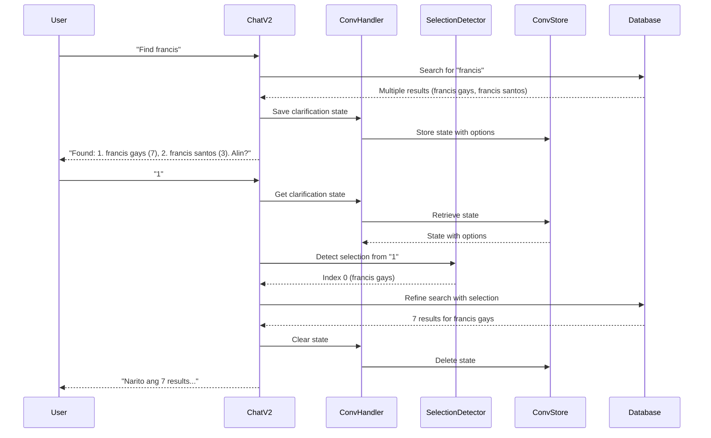

# Design Document: Phase 3 Conversation Integration

## Overview

Phase 3 completes the conversational AI system by integrating selection detection and conversation state management with the existing Chat V2 endpoint. The design follows the data-agnostic principle established in Phase 1 and Phase 2, ensuring the system works with ANY data without code changes.

### Design Goals

1. **Data-Agnostic Selection Detection**: Detect user selections without hardcoded names, projects, or categories
2. **Seamless Integration**: Build on existing Phase 1 & 2 components without breaking changes
3. **Multi-Format Support**: Handle numbers, ordinals (English/Tagalog), natural language, and name matching
4. **Robust State Management**: Reliably persist and retrieve conversation state
5. **Graceful Degradation**: Continue operating even when conversation state is unavailable

### Key Principles

- **Search-First Pattern**: Always search database before asking clarification (Phase 2)
- **Data-Agnostic**: NO hardcoded table/file/project/person names
- **Strategy Pattern**: Multiple selection detection strategies with priority ordering
- **Fail-Safe**: Treat unclear selections as new queries rather than failing

## Architecture

### System Context

```
┌─────────────────────────────────────────────────────────────┐
│                     Chat V2 Endpoint                        │
│  (Existing - Phase 2)                                       │
└────────────┬────────────────────────────────┬───────────────┘
             │                                │
             │ Uses                           │ Uses
             ▼                                ▼
┌────────────────────────┐      ┌────────────────────────────┐
│  Selection Detector    │      │  Conversation Handler      │
│  (NEW - Phase 3)       │      │  (NEW - Phase 3)           │
│                        │      │                            │
│  - Number Detection    │      │  - Save State              │
│  - Ordinal Detection   │      │  - Retrieve State          │
│  - Natural Language    │      │  - Clear State             │
│  - Name Matching       │      │  - Expiration Check        │
└────────────────────────┘      └────────────┬───────────────┘
                                             │
                                             │ Uses
                                             ▼
                                ┌────────────────────────────┐
                                │  Conversation Store        │
                                │  (Existing - Phase 1)      │
                                │                            │
                                │  - In-memory storage       │
                                │  - TTL management          │
                                │  - Session isolation       │
                                └────────────────────────────┘
```

### Integration Flow



## Components and Interfaces

### 1. SelectionDetector

**Purpose**: Detect user selections from various input formats without hardcoded assumptions.

**Interface**:

```python
class SelectionDetector:
    """
    Detects user selections using multiple strategies.
    Data-agnostic: works with ANY options without hardcoded names.
    """
    
    @staticmethod
    def detect(
        user_input: str,
        options: List[Dict[str, Any]]
    ) -> Optional[int]:
        """
        Detect which option user selected.
        
        Args:
            user_input: User's response (e.g., "1", "una", "francis gays")
            options: Available options from clarification state
        
        Returns:
            0-based index of selected option, or None if no match
        """
        pass
    
    @staticmethod
    def _detect_number(user_input: str, num_options: int) -> Optional[int]:
        """Strategy 1: Direct number detection (1, 2, 3)"""
        pass
    
    @staticmethod
    def _detect_english_ordinal(user_input: str, num_options: int) -> Optional[int]:
        """Strategy 2: English ordinal detection (first, second, third)"""
        pass
    
    @staticmethod
    def _detect_tagalog_ordinal(user_input: str, num_options: int) -> Optional[int]:
        """Strategy 3: Tagalog ordinal detection (una, pangalawa, pangatlo)"""
        pass
    
    @staticmethod
    def _detect_natural_language(user_input: str, num_options: int) -> Optional[int]:
        """Strategy 4: Natural language detection (yung una, yung pangalawa)"""
        pass
    
    @staticmethod
    def _detect_name_match(user_input: str, options: List[Dict[str, Any]]) -> Optional[int]:
        """Strategy 5: Name/identifier matching (francis gays, TEST project)"""
        pass
```

**Strategy Priority**:
1. Number detection (fastest, most explicit)
2. English ordinal detection
3. Tagalog ordinal detection
4. Natural language detection
5. Name matching (slowest, most fuzzy)

**Design Decisions**:
- **Strategy Pattern**: Each detection method is independent and testable
- **Priority Ordering**: Try explicit methods before fuzzy matching
- **Data-Agnostic**: Name matching works with ANY field values, no hardcoding
- **Fail-Safe**: Return None rather than guessing incorrectly

### 2. ConversationHandler

**Purpose**: Manage conversation state lifecycle (save, retrieve, clear, expire).

**Interface**:

```python
class ConversationHandler:
    """
    Manages conversation state for multi-turn dialogues.
    Wraps ConversationStore with Phase 3-specific logic.
    """
    
    @staticmethod
    def save_clarification(
        user_id: str,
        original_query: str,
        search_term: str,
        options: List[Dict[str, Any]],
        results: List[Dict[str, Any]]
    ) -> None:
        """
        Save clarification state when multiple results found.
        
        Args:
            user_id: User session identifier
            original_query: User's original query
            search_term: Extracted search term
            options: Clarification options (grouped results)
            results: Full result set from database
        """
        pass
    
    @staticmethod
    def get_clarification(user_id: str) -> Optional[Dict[str, Any]]:
        """
        Retrieve clarification state if exists and not expired.
        
        Returns:
            Clarification state dict or None if not found/expired
        """
        pass
    
    @staticmethod
    def clear_clarification(user_id: str) -> None:
        """Clear clarification state (conversation complete)."""
        pass
    
    @staticmethod
    def is_expired(state: Dict[str, Any]) -> bool:
        """Check if conversation state has expired (>5 minutes)."""
        pass
```

**State Structure**:

```python
{
    'type': 'MULTIPLE_MATCHES',
    'original_query': str,      # User's original query
    'search_term': str,          # Extracted search term
    'options': List[Dict],       # Clarification options
    'last_results': List[Dict],  # Full result set
    'timestamp': datetime,       # When state was created
    'step': int                  # Conversation step (for future multi-step)
}
```

**Design Decisions**:
- **Thin Wrapper**: Delegates to existing ConversationStore, adds Phase 3 logic
- **Expiration**: 5-minute TTL to prevent stale conversations
- **Session Isolation**: Each user_id has independent state
- **Fail-Safe**: Return None for expired/missing state rather than raising errors

### 3. Chat V2 Endpoint Integration

**Modified Flow**:

```python
@router.post("/chat/v2")
async def chat_v2(request: ChatRequest):
    """
    Enhanced with conversation state management.
    """
    user_id = get_user_id(request)
    
    # Check for pending clarification
    clarification_state = ConversationHandler.get_clarification(user_id)
    
    if clarification_state:
        # User is responding to clarification
        return await handle_clarification_response(
            request, user_id, clarification_state
        )
    else:
        # New query
        return await handle_new_query(request, user_id)


async def handle_clarification_response(
    request: ChatRequest,
    user_id: str,
    state: Dict[str, Any]
) -> ChatResponse:
    """
    Handle user's response to clarification.
    """
    # Detect selection
    options = state['options']
    selection_index = SelectionDetector.detect(request.query, options)
    
    if selection_index is not None:
        # Valid selection - refine search
        selected_option = options[selection_index]
        refined_results = filter_results_by_selection(
            state['last_results'],
            selected_option
        )
        
        # Clear state
        ConversationHandler.clear_clarification(user_id)
        
        return build_success_response(refined_results)
    else:
        # Unclear selection - ask again or treat as new query
        if looks_like_selection_attempt(request.query):
            return build_retry_clarification_response(options)
        else:
            # Treat as new query
            ConversationHandler.clear_clarification(user_id)
            return await handle_new_query(request, user_id)
```

**Design Decisions**:
- **State-First Check**: Always check for pending clarification before processing
- **Graceful Fallback**: Treat unclear selections as new queries
- **Automatic Cleanup**: Clear state after successful selection
- **No Breaking Changes**: Existing Chat V2 functionality unchanged

## Data Models

### SelectionStrategy Enum

```python
from enum import Enum

class SelectionStrategy(Enum):
    """Selection detection strategies in priority order."""
    NUMBER = "number"
    ENGLISH_ORDINAL = "english_ordinal"
    TAGALOG_ORDINAL = "tagalog_ordinal"
    NATURAL_LANGUAGE = "natural_language"
    NAME_MATCH = "name_match"
```

### SelectionResult

```python
from dataclasses import dataclass
from typing import Optional

@dataclass
class SelectionResult:
    """Result of selection detection."""
    index: Optional[int]              # 0-based index, None if no match
    strategy: Optional[SelectionStrategy]  # Which strategy succeeded
    confidence: float                 # Confidence score (0-1)
    matched_text: Optional[str]       # What text matched
```

### ClarificationState

```python
from dataclasses import dataclass
from datetime import datetime
from typing import List, Dict, Any

@dataclass
class ClarificationState:
    """Conversation state for clarification."""
    user_id: str
    original_query: str
    search_term: str
    options: List[Dict[str, Any]]
    last_results: List[Dict[str, Any]]
    timestamp: datetime
    step: int = 1
    
    def is_expired(self, ttl_minutes: int = 5) -> bool:
        """Check if state has expired."""
        age = datetime.now() - self.timestamp
        return age.total_seconds() > (ttl_minutes * 60)
```

### Option Structure

```python
# Each option in clarification state
{
    'name': str,        # Primary identifier (file_name, person_name, etc.)
    'project': str,     # Project name (if applicable)
    'source': str,      # Source table/type
    'count': int,       # Number of records
    # Additional fields from database (data-agnostic)
}
```


## Correctness Properties

*A property is a characteristic or behavior that should hold true across all valid executions of a system—essentially, a formal statement about what the system should do. Properties serve as the bridge between human-readable specifications and machine-verifiable correctness guarantees.*

### Selection Detection Properties

**Property 1: Number Selection Mapping**

*For any* list of options and any digit string representing a valid 1-based index (1 to N), the Selection_Detector should return the corresponding 0-based index (0 to N-1).

**Validates: Requirements 1.1, 1.2**

**Property 2: Out-of-Range Rejection**

*For any* list of N options and any selection input (number, ordinal, or natural language) that references an index outside the range [1, N], the Selection_Detector should return None.

**Validates: Requirements 1.3, 2.4, 3.4**

**Property 3: English Ordinal Mapping**

*For any* list of options, when a user inputs an English ordinal word ("first", "second", "third", etc.) within the valid range, the Selection_Detector should map it to the correct 0-based index (first→0, second→1, third→2, etc.).

**Validates: Requirements 2.1, 2.2, 2.3**

**Property 4: Tagalog Ordinal Mapping**

*For any* list of options, when a user inputs a Tagalog ordinal word ("una", "pangalawa", "pangatlo", etc.) within the valid range, the Selection_Detector should map it to the correct 0-based index (una→0, pangalawa→1, pangatlo→2, etc.).

**Validates: Requirements 3.1, 3.2, 3.3**

**Property 5: Case Insensitivity**

*For any* valid selection input (number, ordinal, or name), the Selection_Detector should produce the same result regardless of the input's case (lowercase, uppercase, or mixed case).

**Validates: Requirements 2.5, 3.5, 5.5**

**Property 6: Natural Language Ordinal Extraction**

*For any* phrase containing an ordinal word (English or Tagalog), the Selection_Detector should extract the ordinal and map it to the correct index, regardless of surrounding words.

**Validates: Requirements 4.1, 4.2, 4.3**

**Property 7: Unique Name Matching**

*For any* list of options where exactly one option contains a given name substring, the Selection_Detector should return that option's index when the user inputs that name or substring.

**Validates: Requirements 5.1, 5.2**

**Property 8: Ambiguous Name Rejection**

*For any* list of options where multiple options contain the same name substring, the Selection_Detector should return None when the user inputs that ambiguous name.

**Validates: Requirements 5.3**

**Property 9: Strategy Priority Order**

*For any* input that could match multiple strategies, the Selection_Detector should apply strategies in priority order (number → English ordinal → Tagalog ordinal → natural language → name matching) and return the result from the first successful strategy.

**Validates: Requirements 10.1, 10.2, 10.3, 10.4, 10.5**

### Conversation State Properties

**Property 10: State Persistence Round-Trip**

*For any* clarification state saved by the Conversation_Handler, retrieving the state immediately afterward should return an equivalent state with all fields preserved (original_query, search_term, options, results, timestamp).

**Validates: Requirements 6.1, 6.2, 6.5**

**Property 11: Session Isolation**

*For any* two different user IDs, saving a clarification state for one user should not affect the state of the other user, and retrieving state for one user should only return that user's state.

**Validates: Requirements 6.4**

**Property 12: State Expiration**

*For any* conversation state older than 5 minutes, the Conversation_Handler should consider it expired, return None when retrieving it, and delete it from storage.

**Validates: Requirements 11.1, 11.2, 11.3, 11.4**

**Property 13: State Cleanup After Success**

*For any* successful selection detection, the conversation state should be immediately cleared from storage, and subsequent retrieval attempts should return None.

**Validates: Requirements 7.5, 8.3, 11.5**

### Integration Properties

**Property 14: Selection Detection Trigger**

*For any* user message received when conversation state exists, the Chat_V2_Endpoint should attempt selection detection before treating the message as a new query.

**Validates: Requirements 7.1**

**Property 15: Successful Selection Refinement**

*For any* successful selection detection, the Chat_V2_Endpoint should extract the selected option from conversation state and filter the last_results to only include records matching that option.

**Validates: Requirements 7.2**

**Property 16: Failed Selection Fallback**

*For any* selection detection that returns None, the Chat_V2_Endpoint should clear the conversation state and treat the message as a new query.

**Validates: Requirements 7.4, 8.5, 12.1, 12.2**

**Property 17: Multi-Result Clarification Trigger**

*For any* database search that returns more than one distinct result group, the Chat_V2_Endpoint should generate clarification options, save conversation state, and present the options to the user.

**Validates: Requirements 8.1**

**Property 18: Graceful Degradation**

*For any* error during conversation state operations (save failure, retrieval failure, store unavailable), the Chat_V2_Endpoint should continue operating by treating messages as new queries and still returning responses to the user.

**Validates: Requirements 12.3, 12.4**

### Data-Agnostic Properties

**Property 19: Data-Agnostic Selection Detection**

*For any* new data added to the database (person names, project names, categories, etc.) that was not in the original sample, the Selection_Detector should detect selections for that data without requiring code changes.

**Validates: Requirements 9.1, 9.2, 9.4, 13.2, 13.3**

**Property 20: No Hardcoded Identifiers**

*For any* field value in the options list (name, project, source, etc.), the Selection_Detector should perform matching based on the actual field values without relying on hardcoded lists of valid names, projects, or categories.

**Validates: Requirements 9.5** (Note: This is partially a code review property, but can be tested by verifying the system works with completely novel data)

## Error Handling

### Error Categories

1. **Selection Detection Errors**
   - Invalid input format
   - Ambiguous selections
   - Out-of-range selections
   - Unrecognizable patterns

2. **Conversation State Errors**
   - State retrieval failure
   - State save failure
   - Expired state
   - Missing state

3. **Integration Errors**
   - Database unavailable
   - Conversation store unavailable
   - Unexpected exceptions

### Error Handling Strategy

**Fail-Safe Principle**: When in doubt, treat as new query rather than failing.

```python
def handle_error(error_type: str, context: Dict) -> ChatResponse:
    """
    Unified error handling strategy.
    
    All errors result in:
    1. Log detailed error information
    2. Clear any pending conversation state
    3. Treat user input as new query
    4. Return helpful message to user
    """
    logger.error(f"Error in {error_type}: {context}")
    
    # Clear state to prevent stuck conversations
    if 'user_id' in context:
        ConversationHandler.clear_clarification(context['user_id'])
    
    # Treat as new query
    return await handle_new_query(context['request'], context['user_id'])
```

### Specific Error Scenarios

**Scenario 1: Selection Detection Exception**
```python
try:
    selection_index = SelectionDetector.detect(user_input, options)
except Exception as e:
    logger.error(f"Selection detection failed: {e}")
    # Fallback: treat as new query
    return await handle_new_query(request, user_id)
```

**Scenario 2: Expired Conversation State**
```python
state = ConversationHandler.get_clarification(user_id)
if state is None:  # Expired or missing
    # Treat as new query (no error message needed)
    return await handle_new_query(request, user_id)
```

**Scenario 3: Ambiguous Selection**
```python
if selection_index is None:
    if looks_like_selection_attempt(user_input):
        # User tried to select but we didn't understand
        return ChatResponse(
            message="Hindi ko naintindihan. Pwede mo bang ulitin? (1, 2, 3, o name)",
            data=options
        )
    else:
        # Looks like a new query
        ConversationHandler.clear_clarification(user_id)
        return await handle_new_query(request, user_id)
```

**Scenario 4: Conversation Store Unavailable**
```python
try:
    ConversationHandler.save_clarification(...)
except Exception as e:
    logger.error(f"Failed to save conversation state: {e}")
    # Still return clarification to user (degraded mode)
    return ChatResponse(
        message=clarification_message,
        data=results
    )
    # Note: User won't be able to select, but they see results
```

## Testing Strategy

### Dual Testing Approach

The testing strategy combines unit tests for specific examples and edge cases with property-based tests for universal correctness properties. Both are necessary and complementary:

- **Unit tests**: Verify specific examples, edge cases, and integration points
- **Property tests**: Verify universal properties across all inputs through randomization

### Unit Testing Focus

Unit tests should focus on:
- Specific examples that demonstrate correct behavior (e.g., "1" → index 0)
- Edge cases (e.g., zero input, empty options list)
- Integration points between components
- Error conditions and exception handling

Avoid writing too many unit tests for cases that property tests can cover through randomization.

### Property-Based Testing Configuration

**Library Selection**: Use `hypothesis` for Python property-based testing

**Configuration**:
- Minimum 100 iterations per property test (due to randomization)
- Each property test must reference its design document property
- Tag format: `# Feature: phase3-conversation-integration, Property {number}: {property_text}`

**Example Property Test Structure**:

```python
from hypothesis import given, strategies as st
import pytest

# Feature: phase3-conversation-integration, Property 1: Number Selection Mapping
@given(
    num_options=st.integers(min_value=1, max_value=10),
    selection=st.integers(min_value=1, max_value=10)
)
@pytest.mark.property_test
def test_number_selection_mapping(num_options, selection):
    """
    Property 1: For any list of options and any digit string representing 
    a valid 1-based index, the Selection_Detector should return the 
    corresponding 0-based index.
    """
    # Arrange
    options = [{'name': f'option_{i}'} for i in range(num_options)]
    
    # Act
    if 1 <= selection <= num_options:
        result = SelectionDetector.detect(str(selection), options)
        
        # Assert
        assert result == selection - 1, \
            f"Expected {selection-1}, got {result}"
    else:
        # Out of range - should be tested by Property 2
        pass
```

### Test Data Strategy

**Random Data Generation**:
- Generate random person names NOT in original sample (john santos, maria reyes, pedro cruz)
- Generate random project names NOT in original sample (Manila Building, Cebu Tower)
- Generate random categories NOT in original sample (materials, equipment)
- Verify system works without code changes

**Data-Agnostic Test Pattern**:

```python
# Feature: phase3-conversation-integration, Property 19: Data-Agnostic Selection Detection
@given(
    person_name=st.text(min_size=5, max_size=20, alphabet=st.characters(whitelist_categories=('Lu', 'Ll', 'Nd'))),
    project_name=st.text(min_size=5, max_size=20, alphabet=st.characters(whitelist_categories=('Lu', 'Ll', 'Nd')))
)
@pytest.mark.property_test
def test_data_agnostic_selection(person_name, project_name):
    """
    Property 19: For any new data added to the database, the Selection_Detector 
    should detect selections without code changes.
    """
    # Arrange - create options with random data
    options = [
        {'name': person_name, 'project': project_name, 'source': 'test'},
        {'name': 'other_person', 'project': 'other_project', 'source': 'test'}
    ]
    
    # Act - try to select by name
    result = SelectionDetector.detect(person_name, options)
    
    # Assert - should find the match
    assert result == 0, f"Should detect selection for random name: {person_name}"
```

### Integration Testing

**Multi-Turn Conversation Flow**:

```python
@pytest.mark.integration
async def test_multi_turn_conversation_with_random_data():
    """
    Integration test: Complete multi-turn conversation with random data.
    Validates: Requirements 8.2, 13.4, 14.4
    """
    # Arrange - add random data to test database
    random_person = generate_random_person_name()
    await add_test_data(random_person)
    
    # Act - Turn 1: Initial query
    response1 = await chat_v2(ChatRequest(query=f"Find {random_person}"))
    
    # Assert - Should get clarification
    assert "Alin" in response1.message
    assert len(response1.data) > 1
    
    # Act - Turn 2: Selection
    response2 = await chat_v2(ChatRequest(query="1"))
    
    # Assert - Should get refined results
    assert len(response2.data) >= 1
    assert response2.data[0]['name'] == random_person
    
    # Assert - State should be cleared
    state = ConversationHandler.get_clarification("test_user")
    assert state is None
```

### Test Coverage Goals

- **Selection Detection**: 100% coverage of all strategies
- **Conversation State**: 100% coverage of save/retrieve/clear/expire operations
- **Integration**: Cover all conversation flow paths (success, failure, timeout)
- **Error Handling**: Cover all error scenarios with graceful degradation
- **Data-Agnostic**: Prove system works with completely novel data

### Regression Testing

**Existing Features**: All Phase 1 and Phase 2 tests must continue passing
- Semantic extraction tests
- Chat V2 basic functionality tests
- Conversation store tests

**No Breaking Changes**: Integration should not require changes to:
- `semantic_extractor_v2.py`
- `conversation_store.py` schema
- Existing Chat V2 response format
